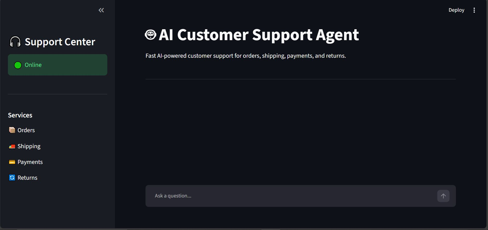
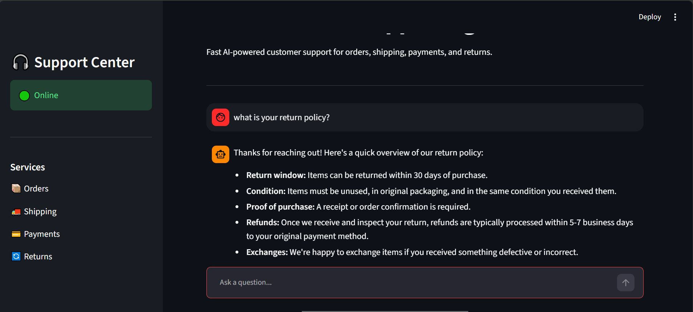

# 🤖 AI Customer Support Agent

An AI-powered customer support assistant built using **Anthropic Claude AI**. The application allows users to interact with an intelligent chatbot that understands customer queries and generates accurate, professional, and human-like responses through a clean Streamlit interface.

## 🚀 Features

- 🤖 AI-powered customer support chatbot
- 💬 Natural language conversations
- ⚡ Fast and responsive Streamlit interface
- 🧠 Intelligent responses using Claude AI
- 🔒 Secure API key management using `.env`
- 🎯 Simple and user-friendly interface

## 🛠️ Tech Stack

- Python
- Streamlit
- Anthropic Claude API
- python-dotenv

## 📂 Project Structure

```text
Customer-Support-Agent-AI/
│
├── src/
│   ├── agent.py
│   ├── streamlit_app.py
│   └── test.py
│
├── .gitignore
├── LICENSE
├── requirements.txt
├── README.md
└── .env (not included)
```

## 📸 Screenshots

### 🏠 Home Page



### 🤖 AI Response



## ⚙️ Installation

Clone the repository:

```bash
git clone https://github.com/maliharana607-debug/Customer-Support-Agent-AI.git
```

Move into the project directory:

```bash
cd Customer-Support-Agent-AI
```

Install the required dependencies:

```bash
pip install -r requirements.txt
```

Create a `.env` file in the project root and add your Anthropic API key:

```env
ANTHROPIC_API_KEY=YOUR_ANTHROPIC_API_KEY
```

## ▶️ Run the Application

```bash
streamlit run src/streamlit_app.py
```

The application will open in your browser at:

```text
http://localhost:8501
```

## 🧠 How It Works

1. The user enters a customer support query.
2. The application sends the prompt to Claude AI.
3. Claude processes the request and generates an intelligent response.
4. The response is displayed instantly in the Streamlit interface.

## 🔮 Future Improvements

- Conversation history
- Multi-language support
- Customer authentication
- Export chat functionality
- Multiple AI model support
- Business-specific customization

## 📄 License

This project is licensed under the MIT License.

## 👩‍💻 Author

**Maliha Rana**

If you found this project useful, consider giving it a ⭐ on GitHub.